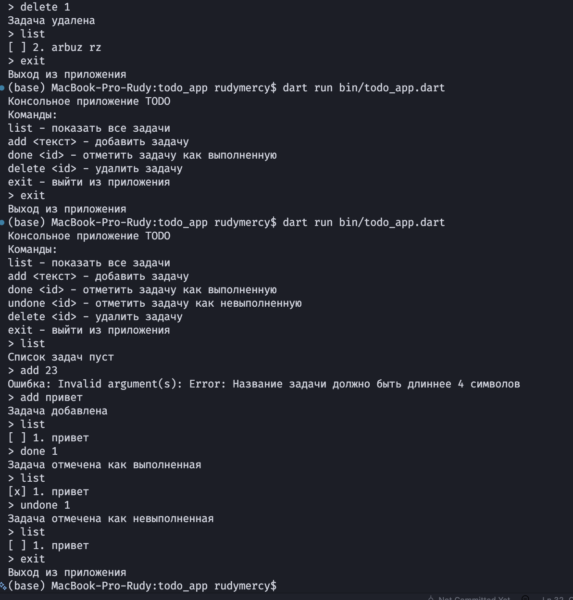

# Лабораторная работа №1. Быстрое погружение в язык Dart

## Основная информация

**ФИО**: Rudy Rudy Rudy

**Группа**: ИСП-233

**Дата**: 24.08.2077

---

## Описание

Консольное приложение для управления списком задач. Позволяет добавлять, удалять и отмечать задачи как выполненные.

## Скриншот приложения

## Как запустить

1. Перейти в папку проекта:
   cd Flutter/todo_app

2. Установить зависимости:
   dart pub get

3. Запустить приложение:
   dart run bin/todo_app.dart

## Что изучили

- Основы языка Dart и его синтаксис
- Работа с коллекциями List, Map, Set
- Асинхронность через Future и async/await

## Ответы на вопросы

### 1. Чем final отличается от const в Dart?

- **final** задается во время выполнения и может быть вычислен динамически.
- **const** задается на этапе компиляции и должен иметь заранее известное значение.

### 2. Что означает String?

`String` это тип данных, представляющий строку текста. В Dart строки являются неизменяемыми.

### 3. Чем `Future` отличается от обычного значения? Что означает `await`?

- `Future` это значение, которое будет получено в будущем, например результат сетевого запроса.  
  Обычное значение доступно сразу.

- `await` приостанавливает выполнение функции до тех пор, пока `Future` не завершится, но не блокирует поток выполнения.

### 4. Зачем в Dart именованные конструкторы?

В Dart нет перегрузки конструкторов как в C#.  
Именованные конструкторы позволяют создавать разные варианты инициализации объекта с понятными именами.
